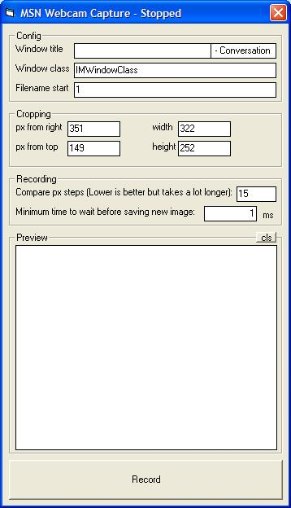

<div align="center">

## A MSN / Windows Live Messenger Webcam Capture Utility


</div>

### Description

Captures a webcam from MSN / Windows Live Messenger (or any other app) and saves the image to the disk. You choose how big to make the result, and where to crop it. Will only save an image to the disk if it differs from the last image it saved (so you dont get tons of the same image saved). Code is not commented, and may be hard to follow. Sorry about that, I just thought I'd share it incase anyone is interested =]
 
### More Info
 


<span>             |<span>
---                |---
**Submitted On**   |2006-07-10 21:14:18
**By**             |[Charles](https://github.com/Planet-Source-Code/PSCIndex/blob/master/ByAuthor/charles.md)
**Level**          |Advanced
**User Rating**    |2.8 (14 globes from 5 users)
**Compatibility**  |VB 6\.0
**Category**       |[Files/ File Controls/ Input/ Output](https://github.com/Planet-Source-Code/PSCIndex/blob/master/ByCategory/files-file-controls-input-output__1-3.md)
**World**          |[Visual Basic](https://github.com/Planet-Source-Code/PSCIndex/blob/master/ByWorld/visual-basic.md)
**Archive File**   |[A\_MSN\_\_\_Wi2006007122006\.zip](https://github.com/Planet-Source-Code/charles-a-msn-windows-live-messenger-webcam-capture-utility__1-65938/archive/master.zip)

### API Declarations

```
Private Declare Function FindWindowEx Lib "user32" Alias "FindWindowExA" (ByVal hWnd1 As Long, ByVal hWnd2 As Long, ByVal lpsz1 As String, ByVal lpsz2 As String) As Long
Private Declare Function FindWindow Lib "user32" Alias "FindWindowA" (ByVal lpClassName As String, ByVal lpWindowName As String) As Long
Private Declare Function ShowWindow Lib "user32" (ByVal hwnd As Long, ByVal nCmdShow As Long) As Long
Private Declare Function GetWindowRect Lib "user32" (ByVal hwnd As Long, lpRect As RECT) As Long
Private Declare Function CreateWindowEx Lib "user32" Alias "CreateWindowExA" (ByVal dwExStyle As Long, ByVal lpClassName As String, ByVal lpWindowName As String, ByVal dwStyle As Long, ByVal X As Long, ByVal Y As Long, ByVal nWidth As Long, ByVal nHeight As Long, ByVal hWndParent As Long, ByVal hMenu As Long, ByVal hInstance As Long, lpParam As Any) As Long
Private Declare Function DestroyWindow Lib "user32" (ByVal hwnd As Long) As Long
Private Declare Function SendMessage Lib "user32" Alias "SendMessageA" (ByVal hwnd As Long, ByVal wMsg As Long, ByVal wParam As Long, lParam As Any) As Long
Private Declare Function EnableWindow Lib "user32" (ByVal hwnd As Long, ByVal fEnable As Long) As Long
Private Declare Sub keybd_event Lib "user32" (ByVal bVk As Byte, ByVal bScan As Byte, ByVal dwFlags As Long, ByVal dwExtraInfo As Long)
```


